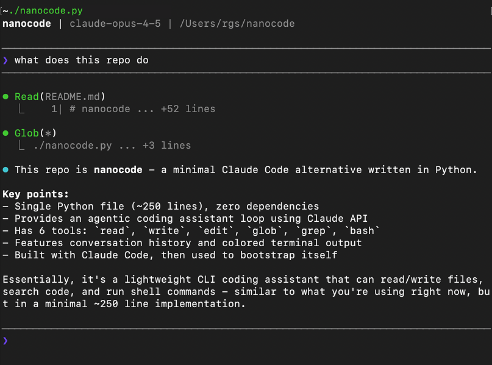

# nanocode

Minimal coding assistant. Single Python file, zero dependencies, ~700 lines.

Built using Claude Code, then used to build itself.

## Experimental Fork

This repository is an experimental fork of the original project by [1rgs/nanocode](https://github.com/1rgs/nanocode).

Fork updates in this repo:
- Improved with Codex
- Added Inception Mercury 2 support (`INCEPTION_API_KEY`, `NANOCODE_PROVIDER=inception`)
- Added a Mercury 2-powered feature: per-turn and session token usage summaries



## Features

- Full agentic loop with tool use
- Inception Mercury 2 provider support
- Tools: `read`, `write`, `edit`, `glob`, `grep`, `bash`
- Per-turn and session token usage summaries
- Conversation history
- Colored terminal output

## Usage

```bash
export ANTHROPIC_API_KEY="your-key"
python nanocode.py
```

### Inception (Mercury)

```bash
export INCEPTION_API_KEY="your-key"
python nanocode.py
```

Optional:

```bash
export NANOCODE_PROVIDER="inception"
export MODEL="mercury-2"
python nanocode.py
```

Optional tuning (Inception):

```bash
export NANOCODE_REASONING_EFFORT="low"     # instant|low|medium|high
export NANOCODE_REASONING_SUMMARY="true"   # true|false
export NANOCODE_TEMPERATURE="0.7"
export NANOCODE_STOP="</end>||DONE"        # up to 4 stop sequences
python nanocode.py
```

### OpenRouter

Use [OpenRouter](https://openrouter.ai) to access any model:

```bash
export OPENROUTER_API_KEY="your-key"
python nanocode.py
```

To use a different model:

```bash
export OPENROUTER_API_KEY="your-key"
export MODEL="openai/gpt-5.2"
python nanocode.py
```

### Dry Run (No API key)

```bash
NANOCODE_DRY_RUN=1 NANOCODE_PROVIDER=inception python nanocode.py
```

`NANOCODE_PROVIDER` supports: `anthropic`, `openrouter`, `inception`.
`NANOCODE_HTTP_TIMEOUT` controls API timeout seconds (minimum 15, default 30).

## Commands

- `/h` or `/help` - Show commands
- `/stats` - Show session token stats
- `Esc` - Interrupt a running `bash` tool command
- `/c` - Clear conversation
- `/q` or `exit` - Quit

## Tools

| Tool | Description |
|------|-------------|
| `read` | Read file with line numbers, offset/limit |
| `write` | Write content to file |
| `edit` | Replace string in file (must be unique) |
| `glob` | Find files by pattern, sorted by mtime |
| `grep` | Search files for regex |
| `bash` | Run shell command (timeout 30s, press `Esc` to interrupt) |

## Example

```
────────────────────────────────────────
❯ what files are here?
────────────────────────────────────────

⏺ Glob(**/*.py)
  ⎿  nanocode.py

⏺ There's one Python file: nanocode.py
```

## License

MIT
